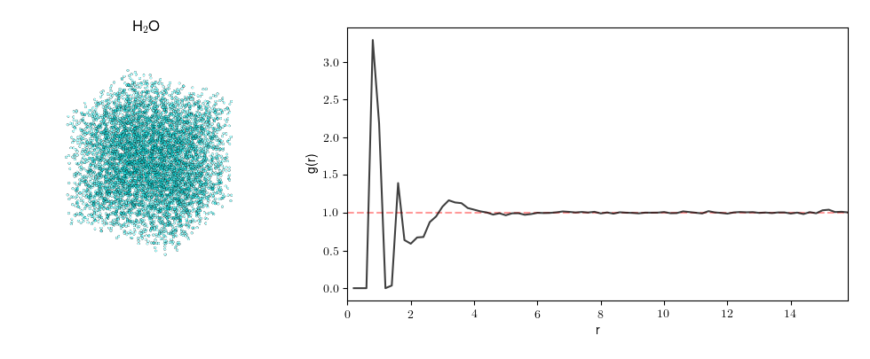

# rdfpy

rdfpy is a Python library for computing fast 2D and 3D radial distribution functions. 





## Installation

```shell
$ pip install rdfpy
```

## Usage

```python
import numpy as np
from rdfpy import rdf3d

particles = np.random.uniform(0.0, 10.0, size=(1000, 3))  # random particles in a 10x10x10 box

g_r, radii = rdf3d(particles, dr=0.1)
```

**Note:** In order for rdfpy to work correctly, your particles should spatially be in a cuboidal box, where the entire box is filled with particles.

## Authors

[Batuhan Yildirim](http://www.mole.phy.cam.ac.uk/people/by.php)

## Citation

If you use **rdfpy** in your work, please cite:

```
@software{batuhan_yildirim_2020_3932173,
  author = {Batuhan Yildirim},
  title = {by256/rdfpy: rdfpy-v0.1.4},
  month = {July},
  year = {2020},
  publisher = {Zenodo},
  version = {v0.1.4},
  doi = {10.5281/zenodo.3932173},
  url = {https://doi.org/10.5281/zenodo.3932173}
}
```

## License

[](http://badges.mit-license.org)

[](https://doi.org/10.5281/zenodo.3932173)


